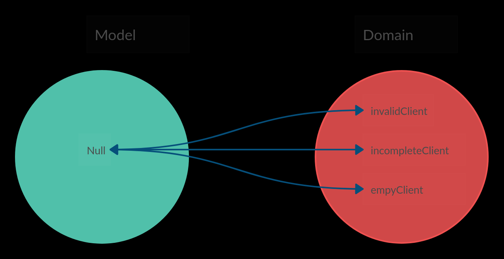

# 编程语言中的Null到底有什么问题？
null是一个标记，当你使用或者调用它的时候，它根据当前上下文的不同表示不同的情况，这会导致至今仍然是软件编程中最为严重的问题，即在对象和其使用者之间耦合隐藏的决策。

这还不够，它还破坏了编程语言的设计原则，即“双射”。用一个实体表示作用域中的多个元素，并使具在上下文中有意义。

一个好的软件原则要求我们具有高内聚性。所有的对象都应该尽可能明确，并且只有一个职责。而任何系统中最缺乏内聚性的对象都就是是通配符:null。



如上图所示，Null映射到了现实世界中的多个不同的概念。

# 灾难性的故障
例1:让我们模拟当前covid-19大流行期间人与人之间的互动。

``` c
final class City {
    public function interactionBetween($somePerson, $anotherPerson) {
        if ($this->meetingProbability() < random()) {
            return null; //no interaction
        } else {
            return new PersonToPersonInteraction($somePerson, $anotherPerson);
        }
    }
}

final class PersonToPersonInteraction {
    public function propagate($aVirus) {
        if ($this->somePerson->isInfectedWith($aVirus) && $aVirus->infectionProbability() > random()) {
            $this->anotherPerson->getInfectedWith($aVirus);
        }
    }
}

$covid19 = new Virus();
$janeDoe = new Person();
$johnSmith = new Person();
$wuhan = new City();

$interaction = $wuhan->interactionBetween($johnSmith, $janeDoe);
if ($interaction != null) {
    $interaction->propagate($covid19);
}

/* In this example we modeled the interaction between an infected person and a healthy one.
Jane is healthy but might be infected if Virus R0 applies to her.*/
```

我们可以看到这里有两个null标志和它对应的if子句。null已经在系统中隐蔽的传播了。

## 一点点历史
null的产生源自于1965年的一次偶然事件。
Tony Hoare，快速排序的发明者，也是图灵奖的获得者。它把null添加到Algol语言的类型系统中，因为它看起来很使用而且容易实现。数十年后他表示非常后悔。

这篇文章详细讲述了这个故事（或者说事故）：

[Null Pointer References: The Billion Dollar Mistake](https://medium.com/@hinchman_amanda/null-pointer-references-the-billion-dollar-mistake-1e616534d485?ref=hackernoon.com)

> 我称它为"价值百亿的错误"，当时，我在设计第一个面向对象语言中的类型系统。我的目标是确保在编译器检查过后，所有的引用都绝对安全。但是我没有经受住null引用的诱惑，因为它太容易实现了。这导致了数不尽的错误，缺陷，和系统崩溃，在往后的四十年中造成了无数的痛苦。
– Tony Hoare, inventor of ALGOL W.

[这里](https://www.infoq.com/presentations/Null-References-The-Billion-Dollar-Mistake-Tony-Hoare/?ref=hackernoon.com)有完整的视频。

## 借口
我们作为开发者，使用null是因为它很加单而且我们觉得它能提高软件的性能。

我们经常忽略一个事实，那就是阅读代码的次数是写代码的10倍，而null的存在正是代码可读性的一个最大的敌人之一。

至于性能，除非极其特殊的情况，性能的损失可以忽略不记。除非在那些优先考虑效率而不是可读性、适应性和可维护性的系统中，使用null才是合理的(在质量方面总是需要权衡)。尽管现代虚拟机已经可以为我们优化代码，但是这个认知偏差却一直存在。

让我们通过例子来具体说明这个问题。

## 快速失败
Null可能被用于掩饰异常情况，然后把错误传播到非常远的地方，产生令人抓狂的涟漪效应。

例二：在给病人表单中要求填写生日。

如果在视图组件中或者创建对象时发生错误，可能导致生日数据变成null。

然后当你运行某个批处理流程来收集患者的所有生日来计算平均年龄时，隐藏的null将产生一个错误。此时你可能需要**深入调用栈很远的地方才能找到这个null值产生的原因**。这意味着本来一个很小的问题，通过调用栈的层层传播，最终你的能花掉几个小时去解决它。

不仅如此，null值的传播可能是在不同的系统，编程语言，API，文件等等，不光是一个调用栈这么见到那。

## 不完整的对象
当我们允许不完整的模型时，这些模型中通常包含null。这些null值会增加代码中的条件控制语句，产生重复的代码，进而增加代码的复杂度。

纵容不完整的模型还让我们犯下两个额外的错误：

1. 不惜用setter污染代码已提供必要的基本信息 <br/> [Nude Models - Part I : Setters](https://hackernoon.com/nude-models-part-i-setters-5tm3u3y?ref=hackernoon.com)
2. 忽略现实实体的不可更改的本质创建可变的模型，违反**双射**。 <br/> [Is it Crystal Clear for Everybody That a Date Should Not Mutate?](https://hackernoon.com/is-it-crystal-clear-for-everybody-that-a-date-should-not-mutate-wuoy3z03?ref=hackernoon.com)

## 不能选择性处理的类型化语言

大多数类型化语言通过确保作为参数(或返回)发送的对象能够响应特定的协议来防止错误。

不幸的是，这些语言中的一些却同时倒退了一步，允许声明对象的值为null。

这使我们不得不使用if来应对对象为nll的情况，违反了[开/闭原则](https://en.wikipedia.org/wiki/Open%E2%80%93closed_principle?ref=hackernoon.com)。

而且，null会破坏类型控件。如果我们使用类型化语言并信任编译器防御网络。Null会像病毒一样穿透它并传播到下文指出的其他类型。

[The worst mistake of computer science - Lucidchart](https://www.lucidchart.com/techblog/2015/08/31/the-worst-mistake-of-computer-science/?ref=hackernoon.com)

## 解决办法
不要使用它

## 替代方案

像往常一样，为了解决我们遇到的问题，我们应该忠实于我们已知的成熟的设计规则。

搜索问题的解决方案，并将它们引入到我们的模型中。

## 模型多态缺席
在上面的例子中，当对象必须声明一个类型时，有更优雅的解决方案可以避免选择使用if进行建模。

在类型化语言中，只需在具体类的兄弟类中使用NullObject设计模式，并根据利斯科夫替换原则(L of SOLID)将超类型声明为协作器的类型。

然而，如果我们决定实现该解决方案，我们将违反另一个设计原则:

我们应该根据基本的原因进行子分类，而不是重用代码或调整类层次结构。

在分类语言中，最好的解决方案是声明一个接口，让实类和空对象类都遵循该接口。

在第一个例子中：
``` 
Interface SocialInteraction{
    public function propagate($aVirus);
}

final class SocialDistancing implements SocialInteraction {
    public function propagate($aVirus) { //Do nothing !!!!
    }
}

final class PersonToPersonInteraction implements SocialInteraction {
    public function propagate($aVirus) {
        if ($this->somePerson->isInfectedWith($aVirus) && $aVirus->infectionProbability() > random()) {
            $this->anotherPerson->getInfectedWith($aVirus);
        }
    }
}

final class City {

    public function interactionBetween($aPerson, $anotherPerson) {
        return new SocialDistancing(); // The cities are smart enough to implement social distancing to model Person to Person interactions
    }
}

$covid19 = new Virus();
$janeDoe = new Person();
$johnSmith = new Person();
$wuhan = new City();

$interaction = $wuhan->interactionBetween($johnSmith, $janeDoe);
$interaction->propagate($covid19);

/* Jane will not be affected since the interaction prevents from propagating the virus
```
这样就没有if和null了。

在这个例子中，我们把null换成了具体的问题域。使用一个类来表示null本该表示的意义，而不是用null来掩盖它，进而让它传播到方法的外部。

## 回顾病人的生日的例子
让我们回到给病人的表单的例子。我们需要计算遗漏未填写表格的平均值。
``` ruby
Interface Visitable {
    public function accept($aVisitor);
}

final class Date implements Visitable {
    public function accept($aVisitor) {
        $aVisitor->visitDate($this);
    }
}

final class DateNotPresent implements Visitable {
    public function accept($aVisitor) {
        $aVisitor->visitDateNotPresent($this);
    }
}

final class AverageCalculator {
    private $count = 0;
    private $ageSum = 0;

    public function visitDate($aDate) {
        $this->count++;
        $this->ageSum += today() - $aDate;
    }

    public function visitDateNotPresent($aDate) {
    }

    public function average() {
        if ($this->count == 0)
            return 0;
        else
            return $this->ageSum / $this->count;
    }
}

function averagePatientsAge($patients) {
    $calculator = new AverageCalculator();
    foreach ($patients as $patient)
        $patient->birthDate()->accept($calculator);
    return $calculator->average();
}
```

我们使用了访问者模式来导航可以表现为空对象的对象。

## 不要null
此外，我们在使用多态时去掉了不必要的计算，并通过开/闭原则使解决方案对除平均计算外的其他计算开放。

我们构建了一个算法较少但更具声明性、可维护性和可扩展性的解决方案。

## 使用带有缺省显式建模的语言

有些语言通过Maybe/Optional的概念可选地支持，这是上面在语言级别实现的拟议解决方案的一个特殊情况。

Conclusions
## 总结
基于我们行业中根深蒂固的实践，使用null是一种不被鼓励的做法。尽管如此，几乎所有的商业语言都允许它，开发人员也使用它。

我们至少应该开始质疑它的使用，并在开发软件时更加成熟和负责任。

[英文原文](https://hackernoon.com/null-the-billion-dollar-mistake-8t5z32d6)